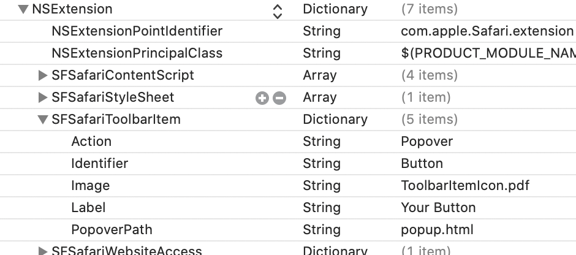

How to add a native popup
=========================

The browser action default popup (or popover), that appears when clicking
the extension icon, has a the chrome API set limited compared to backgound or content.

Enable it by setting the SFSafariToolbarItem Action to Popover.
In addition, specify the path to the popup html as PopoverPath in SFSafariToolbarItem:

You will find these settings in your extension Info.plist.
