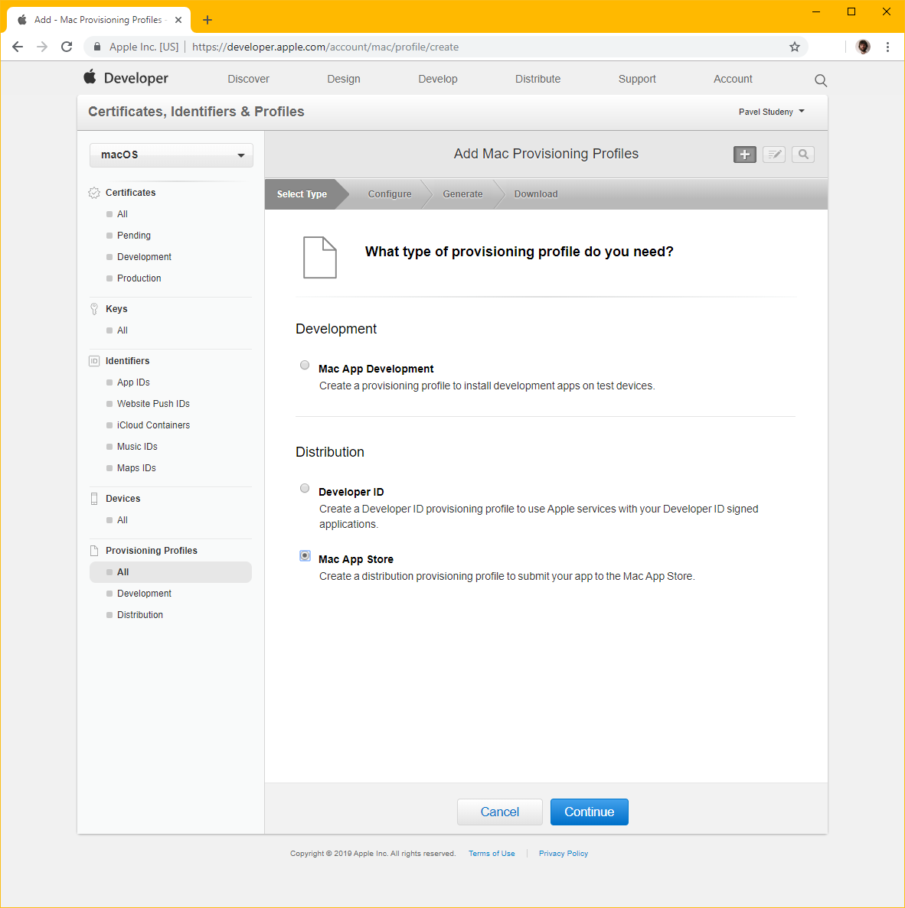
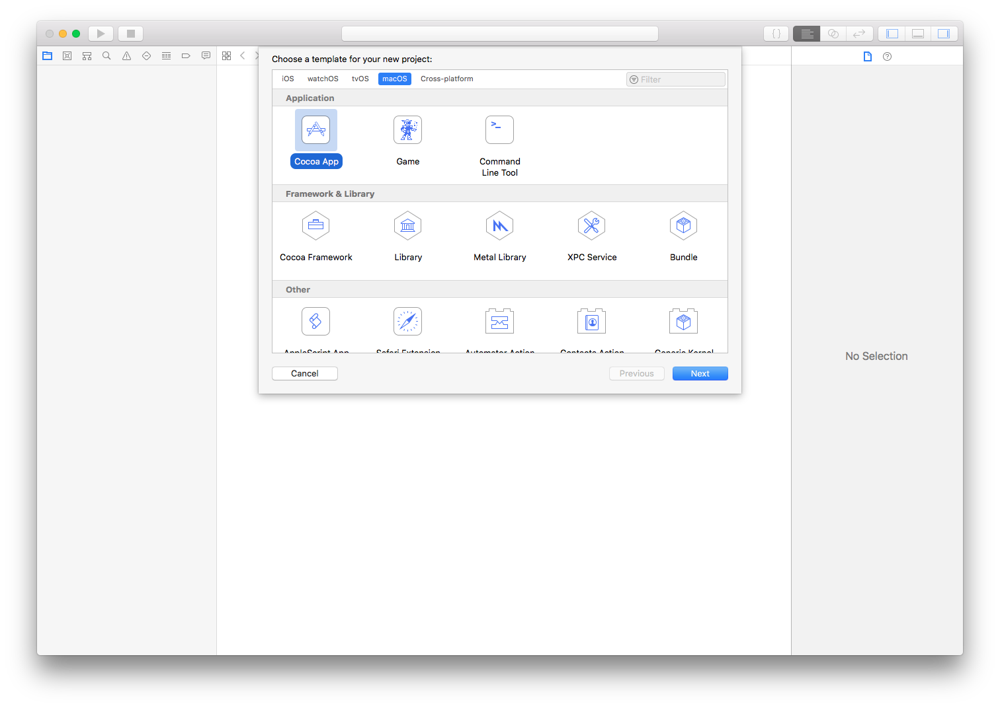
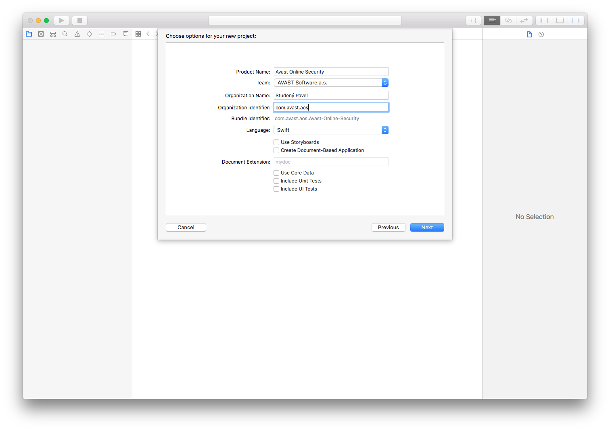
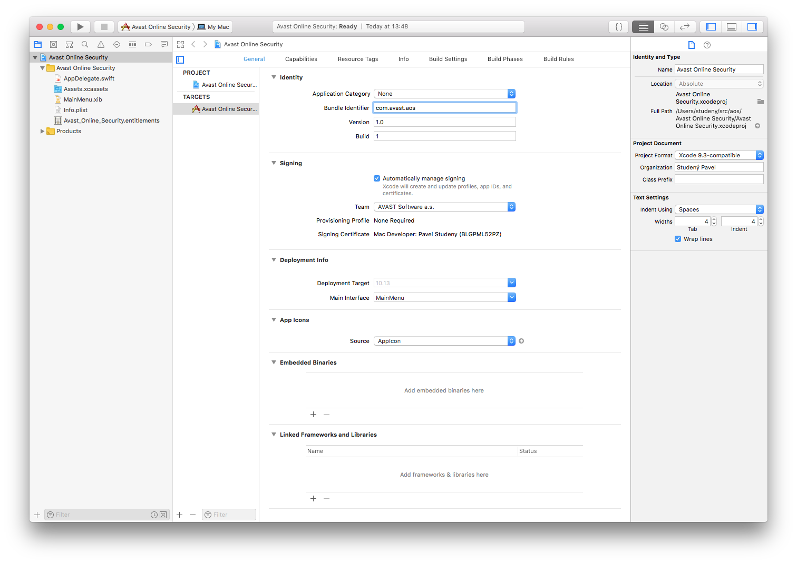
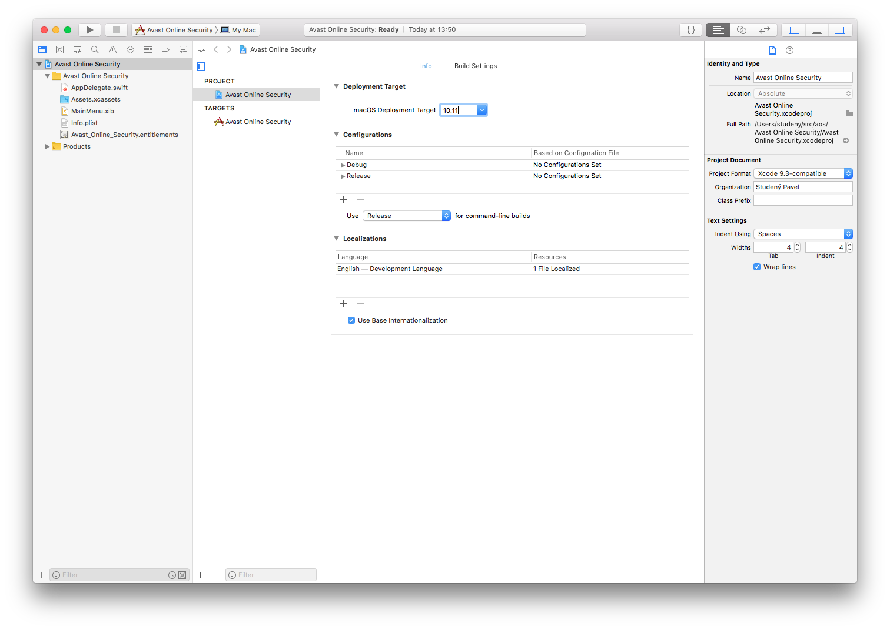
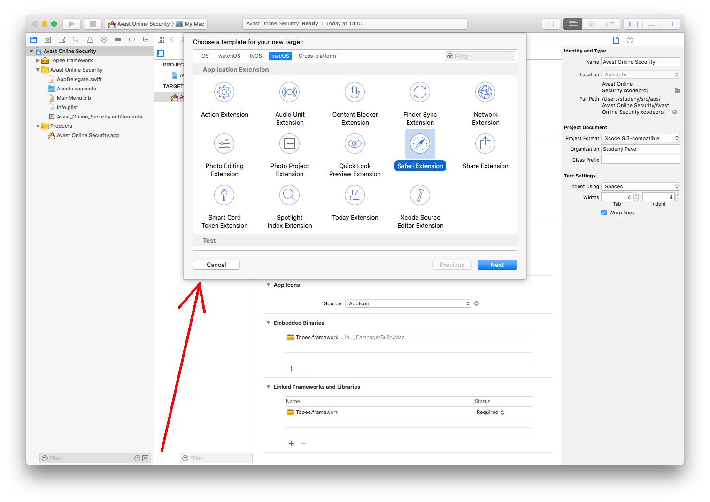
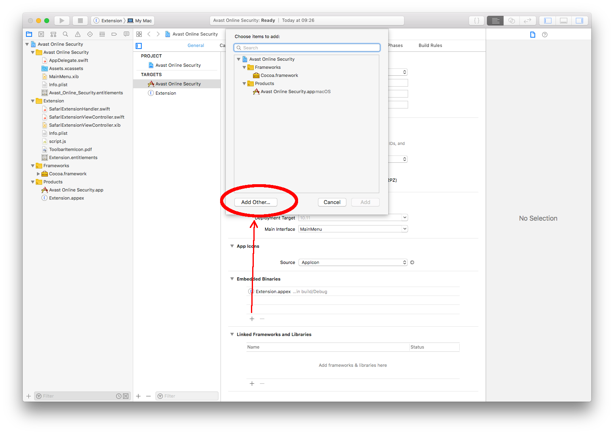
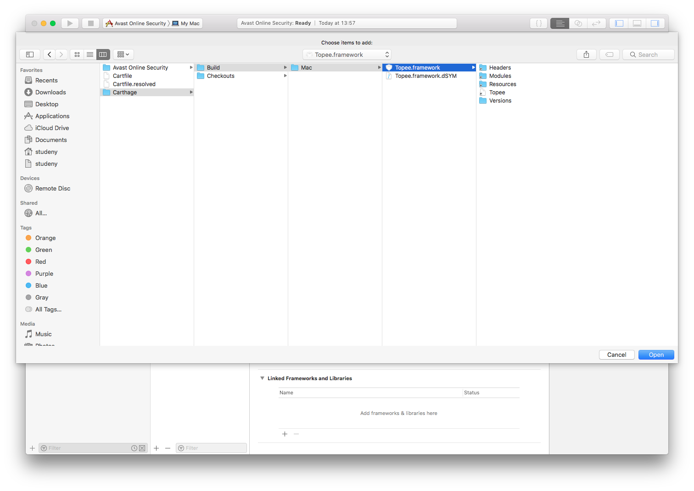
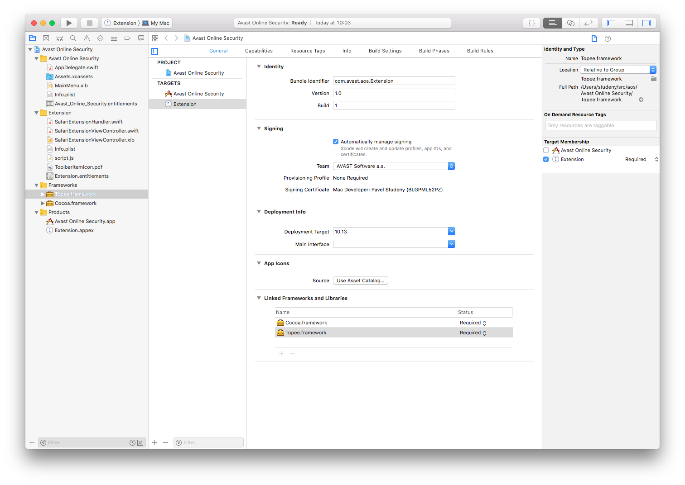
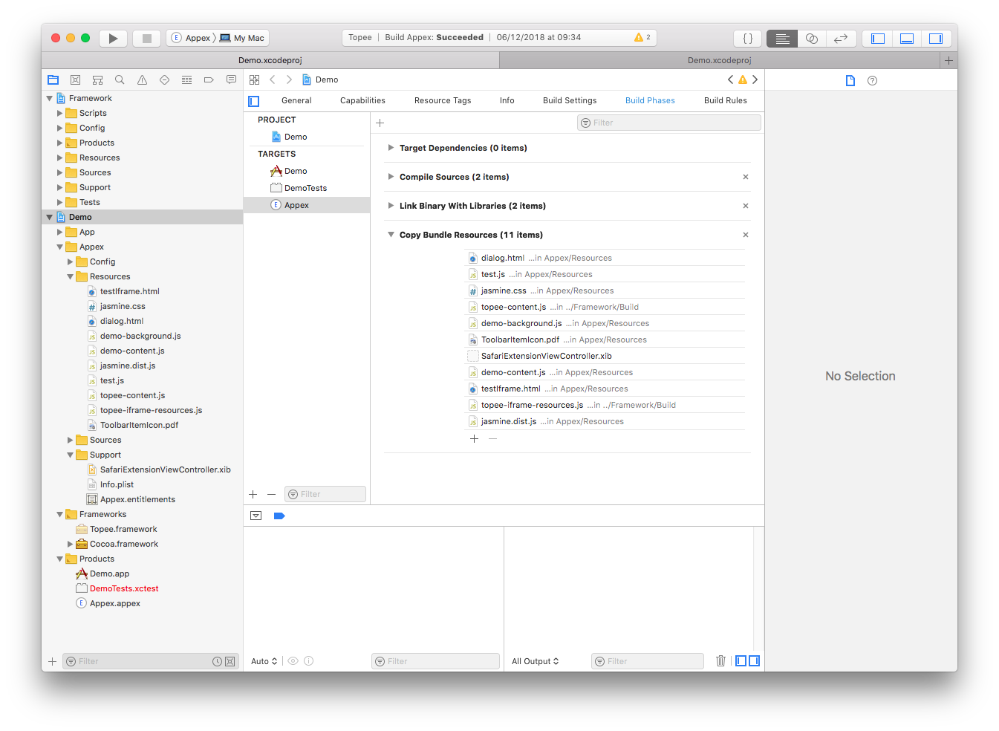

Xcode project wizard
====================

This wizard shows how to setup a Topee-based project from scratch that can be published to the App Store.
A Safari App Extension always has to be embedded in a MacOS application and is distributed as a part of the application.
If you already have an application that you want to add your App Extension into, you can skip the next two sections.

App ID definitions
------------------

If you have not done so already, register at [developer.apple.com](https://developer.apple.com).

Then create your App ID


You also need to define your Provisioning Profiles



In addition to the Mac App Store Provisioning Profile, setup a Mac App Development Provisioning Profile in a similar fashion.

Xcode project
-------------

A Safari App Extension needs to be embedded in a MacOS app. If the extension does not need any application to work,
such an application usually just leads users to Safari preferences where the extension is enabled manually.

Start Xcode and create the application



Set the project options. Bundle Id can be changed later on.



Ajust the Bundle Id later on to match you the one you have created at [developer.apple.com](https://developer.apple.com)



You might also want to set your deployment target to a slightly lower MacOS version than the default



The Appex and Topee references
------------------------------

Xcode has a Safari Extension target that shall be added to your project



There are multiple dependency managers available. This wizard uses [carthage](https://github.com/Carthage/Carthage).
Start a command line in your project directory

```bash
echo "github \"https://github.com/avast/topee\" ~> 1.0.0" >> Cartfile
carthage bootstrap
```

After this, Topee.framework is located in the Carthage/Build/Mac directory.
Add it to the Embedded binaries list




Then select the appex target and drag&drop Topee.framework its Linked Frameworks and Libraries list



Your extension JavaScript
-------------------------

You can simply keep your JavaScript and other resources inside the project repository,
add it as a git submodule or use Carthage to pull releases.

However, you need to bundle them as resources within your package.
You can see this already in the Topee Demo application



To keep your directory structure, it is easier to add a Run Script task to your Build Phases

```bash
rsync -rtv $PROJECT_DIR/../../chrome_extension/img/ $BUILT_PRODUCTS_DIR/$UNLOCALIZED_RESOURCES_FOLDER_PATH/img
```

Now it's time to edit your extension Info.plist as described in [xcode.md](xcode.md),
extend `TopeeSafariExtensionHandler` and run your extension.
When running it for the first time, go to Safari preferences and enable the extension.

