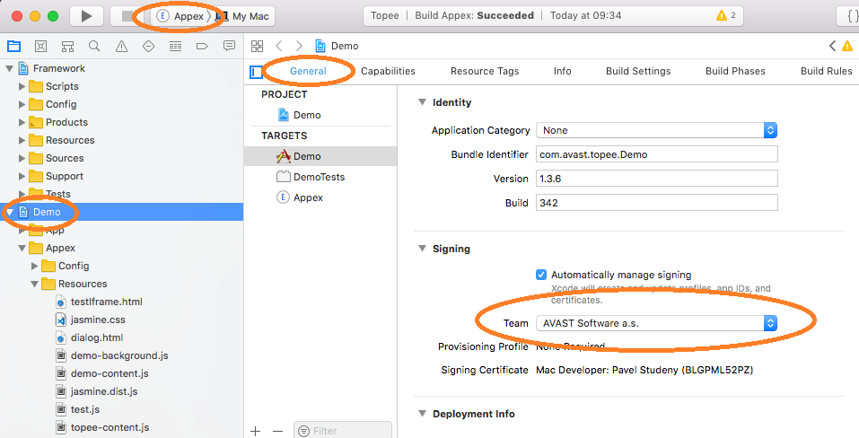

How to Build and Run the Topee Demo Application
===============================================

If you do not have Apple Id, create one at developer.apple.com.
Then, if you are a part of a team, someone needs to add you to the team at developer.apple.com.

Install Xcode from App Store.

Open project (topee/Topee.xcworkspace).

On the left, select Demo. Then, in the center, select General. Set your Team in the Signing section.

Command + Shift + K cleans the project (may be needed if you make changes in JavaScript).
Command + B builds the project.
Select Appex > My Mac on the very top of your Xcode window. Command + R runs the project.
Select Safari. Once Safari is running, go to Preferences, then Extensions and check your extension.
